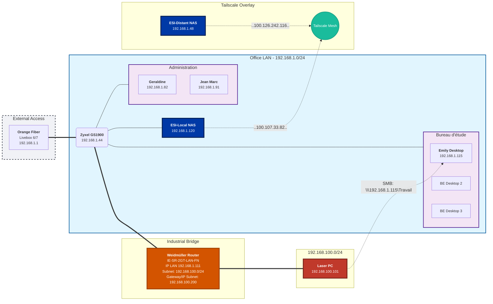

```mermaid
graph LR
    %% Global Styling & Contrast
    classDef default font-family:Arial,font-size:13px;
    classDef internet fill:#f1f2f6,stroke:#2f3542,stroke-width:2px,stroke-dasharray: 5 5;
    classDef office fill:#e1f5fe,stroke:#01579b,stroke-width:2px;
    classDef admin fill:#f3e5f5,stroke:#4a148c,stroke-width:2px;
    classDef nas fill:#0039a6,color:#fff,stroke:#001d52,stroke-width:3px;
    classDef router fill:#d35400,color:#fff,stroke:#a04000,stroke-width:3px;
    classDef laser_pc fill:#c0392b,color:#fff,stroke:#7b241c,stroke-width:3px;
    classDef tailscale fill:#1abc9c,color:#fff,stroke:#16a085,stroke-width:2px;

    %% Internet Edge
    subgraph EXT [External Access]
        ISP[<b>Orange Fiber</b><br/>Livebox 6/7<br/>192.168.1.1]
    end

    %% Central Infrastructure
    subgraph LAN [Office LAN - 192.168.1.0/24]
        Switch(<b>Zyxel GS1900</b><br/>192.168.1.44)
        
        subgraph BE [Bureau d'étude]
            Emily[<b>Emily Desktop</b><br/>192.168.1.115]
            D2[BE Desktop 2]
            D3[BE Desktop 3]
        end

        subgraph ADM [Administration]
            Geraldine[<b>Geraldine</b><br/>192.168.1.82]
            JM[<b>Jean Marc</b><br/>192.168.1.91]
        end

        NAS_L[<b>ESI-Local NAS</b><br/>192.168.1.120]
    end

    %% Bridging Component
    subgraph BRG [Industrial Bridge]
        WR[<b>Weidmüller Router</b><br/>IE-SR-2GT-LAN-FN<br/>IP LAN 192.168.1.111<br/>Subnet: 192.168.100.0/24<br/>Gateway/IP Subnet: 192.168.100.200]
    end

    %% Isolated Production Network
    subgraph LNET [192.168.100.0/24]
        LPC[<b>Laser PC</b><br/>192.168.100.101]
    end

    %% Remote Site & VPN
    subgraph VPN [Tailscale Overlay]
        TS((Tailscale Mesh))
        NAS_D[<b>ESI-Distant NAS</b><br/>192.168.1.48]
    end

    %% Physical and Logical Connections
    ISP === Switch
    Switch --- BE
    Switch --- ADM
    Switch --- NAS_L
    Switch === WR
    WR === LPC

    %% VPN Connections (Tailscale IPs on Arrows)
    NAS_L -.-> | ..100.107.33.82.. | TS
    NAS_D -.-> | ..100.126.242.116.. | TS

    %% Workflow Link
    LPC -.-> | SMB: \\\192.168.1.115\Travail | Emily

    %% Assign Styles
    class EXT internet;
    class LAN office;
    class BE,ADM admin;
    class NAS_L,NAS_D nas;
    class WR router;
    class LPC laser_pc;
    class TS tailscale;
```
