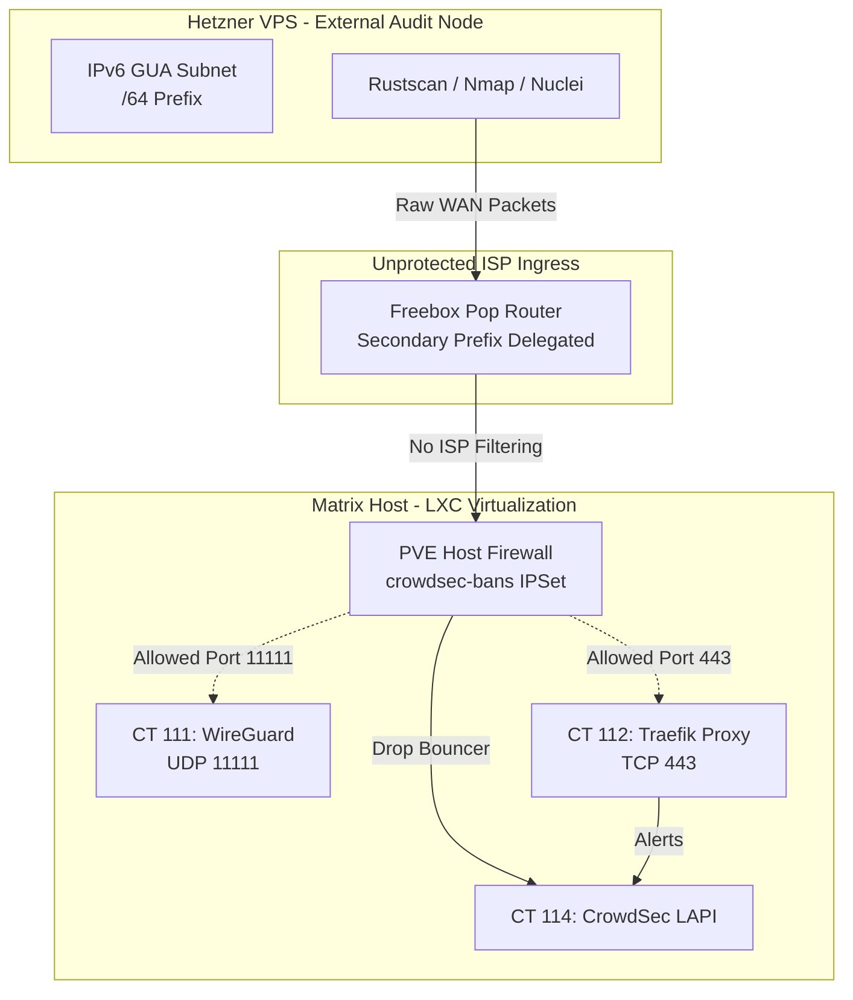

# Project: External WAN Pentesting & IPv6 Security Audit

## 📋 Overview
This project documents the design, setup, and execution of safe external security audits targeting the homelab's public-facing IPv6 Global Unicast Addresses (GUAs). The audit simulates WAN-originated threats using an hourly-billed **Hetzner Cloud VPS** as the external testing node to verify the efficacy of local edge firewalls, reverse proxy SNI rules, and the automated CrowdSec-PVE IPS integration.

---

## 🏗️ Audit Architecture & Scope



### Target Systems
1.  **VPN Ingress Gateway (CT 111):**
    *   **Domain:** `vpn.example-homelab.com`
    *   **GUA IP:** `2001:db8:85a3::111`
    *   **Exposed Port:** `11111/UDP` (WireGuard Handshake)
2.  **Reverse Proxy Ingress (CT 112):**
    *   **Domain:** `example-homelab.com` (and wildcards `*.example-homelab.com`)
    *   **GUA IP:** `2001:db8:85a3::112`
    *   **Exposed Port:** `443/TCP` (HTTPS TLS termination)

---

## ☁️ VPS Infrastructure Setup (Hetzner Cloud)

### 1. Instance Specification
*   **Provider:** Hetzner Cloud (Falkenstein or Nuremberg Datacenter)
*   **Tier:** CPX23 (AMD) or equivalent
*   **Cost:** ~€6.99/month (billed hourly; instance will be destroyed post-testing to maintain zero idle cost).
*   **Operating System:** Debian 13 (Trixie) Minimal (x86_64)
*   **Networking:** Native IPv6 enabled. Hetzner automatically assigns a `/64` IPv6 subnet to each cloud instance.

### 2. AUP (Acceptable Use Policy) Pre-emptive Support Ticket
To avoid account lockout or automated port-scan flag suspensions, copy and paste this ticket into the Hetzner console after creating the server:

```text
Subject: Scheduled Security Auditing of Personal Homelab Infrastructure

Hello Hetzner Support,

I am writing to notify you that I will be conducting scheduled security vulnerability audits targeting my personal homelab infrastructure from this newly created VPS instance. 

The targets are my private domains and associated IPv6 GUAs:
- Hostname: vpn.example-homelab.com (IP: 2001:db8:85a3::111)
- Hostname: example-homelab.com (IP: 2001:db8:85a3::112)

All scanning traffic (using Nmap, Rustscan, and Nuclei... etc) will originate from the IPv6 address of this VPS (Subnet: 2001:db8:9999::/64) and will target only the endpoints listed above. I am the sole administrator of both networks. 

Please note this activity on my account to prevent automated IDS suspensions.

Thank you,
Paolo Ferra
```

---

## 🛠️ Testing Playbook & Verification Commands

### Phase 1: Passive Reconnaissance
Verify what DNS subdomains expose your GUA and test if Cloudflare Proxying is functioning as intended:
```bash
# Query the AAAA records for key services
dig AAAA vpn.example-homelab.com
dig AAAA jellyfin.example-homelab.com
```

### Phase 2: Port Scanning (Rustscan & Nmap)
Perform high-speed port sweeps to verify that closed ports are completely stealth (filtered) and do not return TCP RST or ICMP port unreachable packets.

```bash
# Rustscan: Quickly scan all 65,535 TCP ports on IPv6 (runs in seconds)
rustscan -a vpn.example-homelab.com -- -6 -T4

# Nmap: Deep scanning of open ports to grab versions and OS clues
nmap -6 -sV -sC -Pn -p 443,11111 vpn.example-homelab.com
```

### Phase 3: Vulnerability Templating (Nuclei)
Run lightweight vulnerability scanning to check for outdated configurations, exposed management paths, and SSL cipher handshakes.

```bash
# Scan with default CVE and exposure templates
nuclei -u https://vpn.example-homelab.com -rate-limit 15

# Target HTTP service specifically
nuclei -target https://jellyfin.example-homelab.com -tags cve,ssl,exposure
```

### Phase 4: Host Header and SNI Abuse
Verify that Traefik strictly drops requests that do not match configured SNI domain routers:
```bash
# Attempt to request using raw IP to see if TLS handshake is rejected
curl -v -k https://[your_traefik_gua_ip]

# Inject a spoofed Host Header to see if Authelia authentication is bypassed
curl -v -k -H "Host: forbidden-backend.example-homelab.com" https://[your_traefik_gua_ip]
```

### Phase 5: Intrusion Prevention (CrowdSec) Efficacy Test
Intentionally trigger high-frequency invalid requests to test if the decoupled CrowdSec LAPI automatically updates the Proxmox host-level firewall drop rules.

```bash
# Fuzz Traefik directories to trigger a HTTP-bf rule (fuzz from external VPS)
nuclei -u https://vpn.example-homelab.com -t http/fuzzing/

# Check if the IP was banned inside the CrowdSec Container (CT 114)
cscli decisions list

# Check if the Proxmox host IPset contains the VPS IP
ipset list crowdsec-bans
```

---

## 📝 Audit Logs & Findings

| Date | Testing IP (VPS) | Tool Used | Targets Tested | Findings / Issues | Mitigation Action | Status |
| :--- | :--- | :--- | :--- | :--- | :--- | :--- |
| 2026-06-21 | `2001:db8:9999::1` | `Nmap -6 / Nuclei` | `vpn.example-homelab.com`<br/>`example-homelab.com` | **1.** VPN Host (LXC 111) TCP ports completely closed/filtered. UDP 11111 silent.<br/>**2.** Proxy Host (LXC 112) TCP 443 open; all other TCP ports filtered.<br/>**3.** Nuclei scan triggered WAF ban. | Verified firewall drop integrity. Confirmed CrowdSec successfully banned scanning IP under `http-cve-probing`. | **Resolved** (Secure perimeter) |
| 2026-06-21 | `2001:db8:9999::2` | `curl / OpenSSL / bash` | `jellyfin.example-homelab.com`<br/>`proxy.example-homelab.com` | **1.** TLS 1.1 handshake rejected successfully (no weak protocol cipher leak).<br/>**2.** Custom subdomain scan triggered CrowdSec ban via `http-generic-401-bf`. | Bypassed first ban using IPv6 GUA address binding. Verified that the custom scan was blocked. Unbanned VPS IPs manually on LXC 114. | **Resolved** (Active IPS working) |
| 2026-06-21 | `2001:db8:9999::2` | `Nuclei` | `jellyfin.example-homelab.com` | **1.** Jellyfin exposed directly to WAN without Authelia (intended behavior for smart client apps).<br/>**2.** Targeted template scan returned no active CVEs/vulns. | Confirmed Jellyfin is fully patched. Recommended adding a Jellyfin authentication log parser to CrowdSec to block brute-forcing. | **Resolved** (Exposed but secure) |

