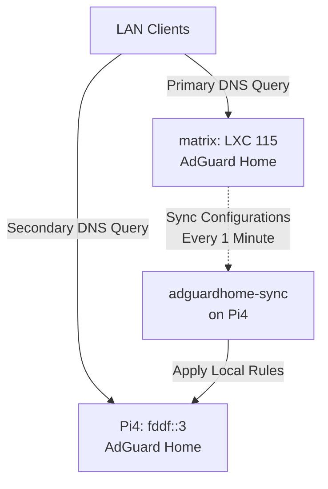

# Project: Pi4 DNS Redundancy Migration & Redeployment (Planned)

## 📋 Overview
This document outlines the roadmap to restore local DNS redundancy and active-active high availability (HA) in the homelab. Currently, the primary DNS resolver runs on **matrix** (AdGuard Home in `LXC 115`). The secondary resolver on **Pi4** (`fddf::3`) was decommissioned during its migration to a headless Moonlight-qt client (Pi Lite Trixie). 

This plan details the steps required to redeploy AdGuard Home and the synchronization daemon on the Pi4 without interfering with its primary role as a low-latency thin client.

---

## 🏗️ Target Architecture

Once redeployed, the DNS setup will return to an active-active HA topology:



### Key Components & Ports
1.  **Primary DNS (matrix LXC 115):** The master source of truth for query filtering, rewrites, and upstream settings.
2.  **Secondary DNS (Pi4 - fddf::3):** The replica node. Runs AdGuard Home bound to `fddf::3` (port 53).
3.  **Sync Daemon (adguardhome-sync on Pi4):** Automatically pulls settings, query logs, blocklists, and custom DNS rewrites from the primary LAPI on matrix.

---

## 🛠️ Implementation Steps (Roadmap)

### Phase 1: Installation on Pi Lite Trixie
1.  **Download and Install AdGuard Home:**
    Download the ARMv8 binary release and extract it to `/opt/AdGuardHome`:
    ```bash
    wget https://static.adguard.com/adguardhome/release/AdGuardHome_linux_arm64.tar.gz
    sudo tar -C /opt/ -xzf AdGuardHome_linux_arm64.tar.gz
    cd /opt/AdGuardHome
    sudo ./AdGuardHome -s install
    ```
2.  **Configure Interface Bindings:**
    During the web wizard (port 3000), bind the DNS server to the physical ULA address `fddf::3` on port 53, and the dashboard administration page to port `80` (or another custom administration port).

### Phase 2: Configuration Synchronization (`adguardhome-sync`)
To ensure settings match the primary resolver dynamically:
1.  **Install adguardhome-sync:**
    Fetch the latest release binary for ARM64 and install it to `/usr/local/bin/`.
2.  **Configuration File Setup (`/etc/adguardhome-sync.yaml`):**
    Configure the sync daemon to pull from the master:
    ```yaml
    api:
      port: 8080
    cron:
      schedule: "*/1 * * * *" # Sync every minute
    origin:
      url: "http://[fddf::115]:80" # matrix Primary AdGuard
      username: "admin"
      password: "PRIMARY_SECRET_PASSWORD"
    replica:
      url: "http://127.0.0.1:80" # Local Pi4 AdGuard
      username: "admin"
      password: "LOCAL_SECRET_PASSWORD"
    ```
3.  **Systemd Integration:**
    Establish a `systemd` service (`adguardhome-sync.service`) to run the daemon persistently in the background.

---

## 🔒 Coexistence & Performance Considerations on Pi4
*   **CPU Overhead:** AdGuard Home and the sync cron job are highly optimized C/Go programs. Memory usage is expected to be under 150MB, meaning it will not steal CPU cycles or introduce frame drops to the `moonlight-qt` stream on `tty1`.
*   **DNS Latency:** Since the Pi4 connects via Wi-Fi (`wlan0`), DNS queries routed to it will have a slightly higher latency (~2-4ms) compared to matrix (~0.5ms). It must remain strictly configured as the secondary fallback DNS client in the router settings to prioritize matrix.
